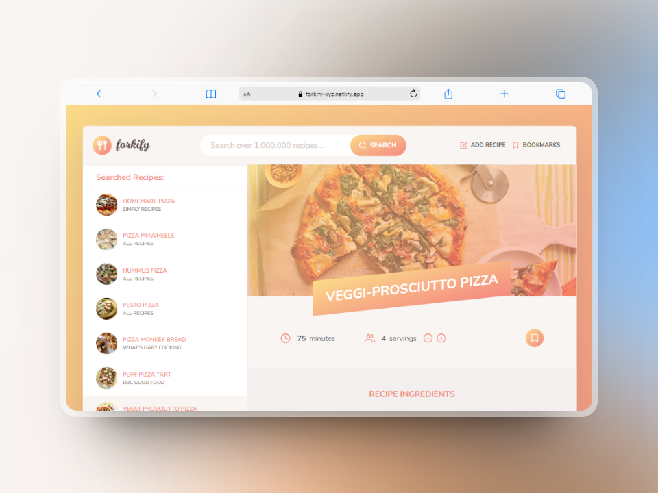

<div id="top"></div>

<div align="center">
  <div>
    
    <p align="center">
      <i align="center">
      Your go-to recipe discovery platform! 🍴
      </i
      >
    </p>
  </div>
  <!-- Project Links -->
  <p align="center">
    <br />
    <a href="https://forkify-xyz.netlify.app/">View Demo</a>
    ·
    <a href="https://github.com/xyzeez/forkify-app/issues" target="_blank">Report Bug</a>
    ·
    <a href="https://github.com/xyzeez/forkify-app/issues" target="_blank">Request Feature</a>
  </p>
  <!-- Badges -->
  <div align="center">
    <!-- Status -->
    <a href="#">
      
    </a>
  </div>



</div>

## Project Description

Forkify is a web application designed to simplify the process of discovering and exploring various recipes. With Forkify, users can effortlessly search for recipes, view detailed ingredients and cooking instructions and also bookmark their favorite recipes for later.

## Built with

 &nbsp;  &nbsp;  &nbsp;  &nbsp;

## Features

1. **Search Functionality**

   - Provide an intuitive search bar for users to input keywords and trigger requests to the API.
   - Display search results dynamically with pagination support for easy navigation.

2. **Recipe Display**

   - Present recipes in a visually appealing layout with clear sections for cooking time, servings, and ingredients.
   - Include high-quality images to entice users and enhance the visual appeal of recipes.
   - Implement responsive design to ensure optimal viewing across various devices and screen sizes.

3. **Change Servings Functionality**

   - Enable users to adjust serving sizes conveniently with an interactive control.
   - Dynamically recalculate ingredient quantities based on the selected number of servings using mathematical formulas.

4. **Bookmarking Functionality**

   - Allow users to bookmark their favorite recipes with a single click.
   - Provide visual cues to indicate bookmarked recipes.
   - Implement a dedicated bookmarking page where users can view their bookmarked recipes.

5. **User-Uploaded Recipes**

   - Enable users to contribute their own recipes by uploading recipe details and images.
   - Implement validation mechanisms to ensure uploaded recipes meet specified criteria.
   - Automatically add user-uploaded recipes to the user's bookmark list for easy access.

6. **Local Storage Integration**
   - Utilize browser local storage to persist user bookmarks across sessions.
   - Implement data synchronization mechanisms to ensure consistency between local storage and server-side data.
   - Provide a seamless user experience by automatically loading saved bookmarks from local storage on page load.

## Flowchart


## Installation

To install the project, follow these steps:

1. Clone the repository:

```bash
git clone https://github.com/yourusername/yourproject.git
```

2. Navigate to the project directory:

```bash
cd yourproject
```

3. Install dependencies:

```bash
npm install
```

4. Start the application:

```bash
npm start
```

## Acknowledgements

- Project from Jonas Schmedtmann's [The Complete JavaScript Course](https://www.udemy.com/course/the-complete-javascript-course/).
